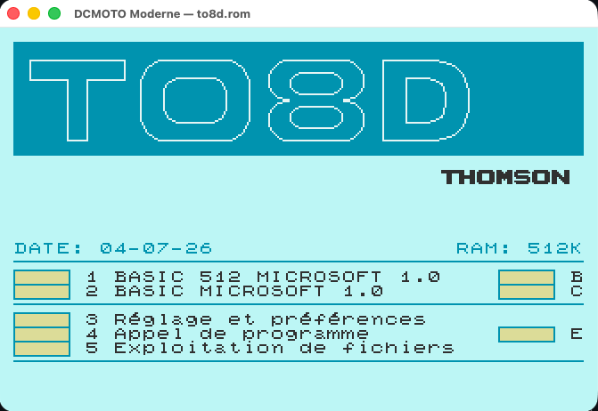
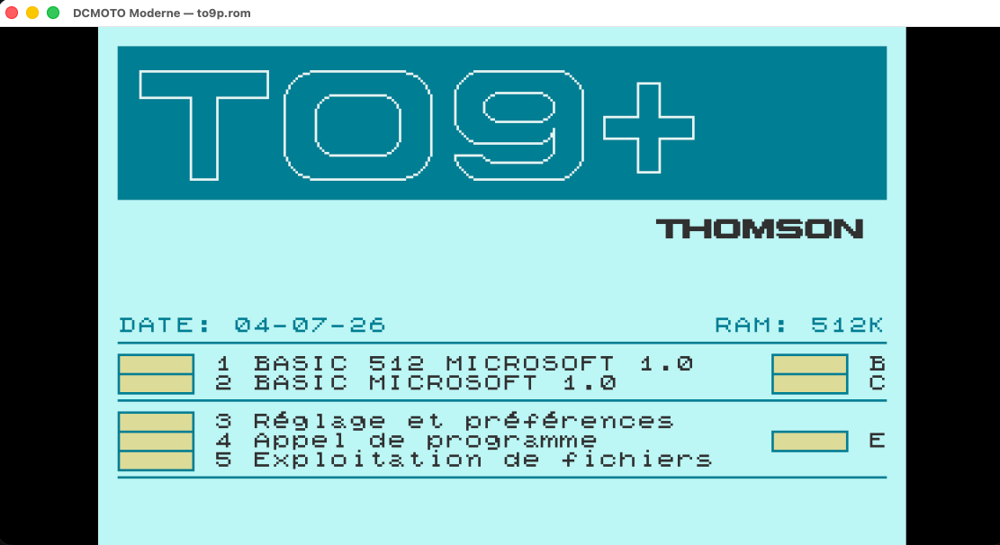

# DCMOTO Moderne

Portage moderne de l'émulateur Thomson [DCMOTO](http://dcmoto.free.fr/) (incluant le MO5, TO8D, TO9+)
(C/SDL, © Daniel Coulom) vers **Go / Ebitengine**.

Ce projet est un logiciel libre sous licence **GNU GPL v3+**. Voir `LICENSE`
et `NOTICE`.

**Version : 2.1.1** — historique dans [`CHANGELOG.md`](CHANGELOG.md).

## Captures d'écran

| Thomson MO5 (Jeu) | Thomson TO8D | Thomson TO9+ |
|:--:|:--:|:--:|
|  |  |  |

---

## Fonctionnalités émulées

- **Machines émulées** : Thomson MO5, TO8D et TO9+ (changement de machine à chaud via l'overlay).
- **Vidéo** : framebuffer logique adapté à chaque machine, palette Thomson, timing faisceau/IRQ 50 Hz.
- **Audio** : mono (haut-parleur 1 bit, échantillonné à 48 kHz).
- **Clavier data-driven** : mapping complet AZERTY/QWERTY (lettres, chiffres, symboles, accents directs). Les touches sont maintenues (jeux + répétition).
- **Joysticks** : émulation au clavier (toggle dans l'overlay) et support de **gamepads standards** (Xbox/PS/Switch Pro, jusqu'à 2 manettes simultanées en hot-plug).
- **Médias** : 
  - Cassette `.k7`
  - Disquette `.fd` (densité variable + DOS contrôleur intégré)
  - Cartouche MEMO5 / ROM `.rom`
- **Voyants média** : LEDs K7/FD dans la fenêtre émulateur, vertes quand un média est monté et rouges pendant un accès.
- **Menu de pilotage in-app (Overlay)** (touche `Échap` ou `Start` sur gamepad) : charger/éjecter les médias à chaud, changer de machine, configurer les joysticks et les LEDs média, Reset / Init prog / Quitter.
- **Saisie programmée** `--exec` (taper une séquence au démarrage) et **copier-coller** depuis le presse-papier (`Cmd+V` / `Ctrl+V`).
- **Préférences utilisateur** mémorisées et portables (Windows / macOS / Linux).
- ROMs systèmes et logiciels **inclus dans le dépôt** (voir [`DESIGN/LICENSING.md`](DESIGN/LICENSING.md)).

### Limites connues

- **Crayon optique** : la routine bas niveau (souris → coordonnées) est en place, mais la fonction BASIC `PEN(...)` **ne suit pas la souris**. Comportement identique à dcmo5 v11. Voir [issue #1](https://github.com/Lesur-ai/DCMOTO-Moderne/issues/1).
- Les extensions spécifiques (Nanoréseau Leanord, QD90-128, etc.) ne sont pas émulées.

---

## Architecture

```
cmd/dcmoto
  ├── internal/app        (Ebitengine : fenêtre, boucle principale, entrées clavier/souris)
  ├── internal/engine     (Moteur d'émulation commun, synchronisation audio/vidéo)
  ├── internal/machine    (Profils matériels et registre)
  │    ├── mo5            (Mémoire et périphériques spécifiques MO5)
  │    ├── to8d           (Mémoire et périphériques spécifiques TO8D)
  │    ├── to9p           (Mémoire et périphériques spécifiques TO9+)
  │    └── gatearray      (Socle commun gate-array pour famille TO)
  ├── internal/core       (Emulation matérielle de base)
  │    ├── cpu6809        (Processeur Motorola 6809)
  │    └── media          (Cassette, disquette, cartouche, imprimante)
  ├── internal/keyboard   (Abstraction du clavier data-driven et gamepads)
  ├── internal/uimodel    (Composants de l'IHM et de l'overlay de configuration)
  ├── internal/audio      (Système audio, buffers et traitement)
  └── internal/spec       (Constantes matérielles et adresses communes)
```

L'architecture est structurée en profils de machine (`internal/machine/...`) pilotés par un moteur d'émulation partagé (`internal/engine`).
Le cœur d'émulation (`core`, `cpu6809`, `media`, `machine`) ne dépend d'aucune bibliothèque graphique, audio ou fichier. Ebitengine (`internal/app`, `internal/uimodel`) est strictement limité à la couche application. La direction de dépendance (cœur technique pur Go ➔ rendu UI) est rigoureusement préservée.

Voir [`DESIGN/ARCHITECTURE.md`](DESIGN/ARCHITECTURE.md) et [`DESIGN/MACHINE_PROFILES.md`](DESIGN/MACHINE_PROFILES.md) pour les décisions structurantes.

---

## ROM et médias

Pour que l'émulateur soit **utilisable immédiatement**, ce dépôt inclut :

- `rom/` — ROM système **MO5** (`mo5-v1.1.rom`), ROM du contrôleur de disquette
  **CD90-640** (`cd90-640.rom`) et ROMs Thomson TO/MO utilisées par les profils
  multi-machines (`to8d.rom`, `to9p.rom`, etc.) ;
- `software/` — une sélection de **logiciels Thomson historiques** (`.k7`,
  `.fd`, `.rom`, `.EPROM`).

> **Provenance & droits.** Ces contenus proviennent du matériel et de l'écosystème
> Thomson MO5 (commercialisé en 1984) et de la communauté de préservation/émulation
> (notamment la distribution [DCMO5 v11](http://dcmoto.free.fr/) de Daniel Coulom).
> Compte tenu de l'ancienneté du matériel et de sa diffusion établie à des fins de
> préservation, le mainteneur les inclut comme raisonnablement redistribuables.
> **Ce n'est pas un avis juridique** et cela n'affirme pas un statut de domaine
> public établi. Tout ayant droit peut demander le retrait d'un contenu en
> **ouvrant une issue** sur le dépôt ; il sera retiré sans délai.

L'application peut aussi démarrer **sans ROM** (message « ROM manquante ») et
accepte l'import de vos propres fichiers. Détails : [`DESIGN/LICENSING.md`](DESIGN/LICENSING.md).

---

## Pré-requis

- **Go 1.26+** (voir `go.mod`)
- Plateformes de bureau supportées : **Windows 10/11**, **macOS** (arm64/amd64),
  **Linux** (amd64) — et plus largement toute cible supportée par Go et Ebitengine.

Le cœur est en Go pur et le rendu passe par **Ebitengine** (multi-plateforme) :
DCMOTO Moderne tourne **nativement** sur les trois OS de bureau.

### Windows — supporté nativement

Aucune dépendance système à installer (Ebitengine utilise l'API graphique native
de Windows). Avec [Go 1.26+](https://go.dev/dl/) :

```powershell
# Lancer depuis la racine du dépôt
go run ./cmd/dcmoto -rom rom\mo5-v1.1.rom

# Ou construire un exécutable
go build -o dcmoto.exe ./cmd/dcmoto
dcmoto.exe -rom rom\mo5-v1.1.rom -tape software\yahtzee-mo5.k7
```

### macOS — supporté nativement

Aucune dépendance à installer ; `go run ./cmd/dcmoto -rom rom/mo5-v1.1.rom`.

### Linux — dépendances système (Ebitengine)

Ebitengine requiert des bibliothèques graphiques système absentes des
environnements CI headless. Pour un build et des tests locaux sur Linux :

```bash
# Debian / Ubuntu
sudo apt-get install -y \
  libgl1-mesa-dev \
  libx11-dev \
  libxcursor-dev \
  libxi-dev \
  libxinerama-dev \
  libxrandr-dev \
  libxxf86vm-dev

# Fedora / RHEL
sudo dnf install -y \
  mesa-libGL-devel \
  libX11-devel \
  libXcursor-devel \
  libXi-devel \
  libXinerama-devel \
  libXrandr-devel \
  libXxf86vm-devel
```

> **CI headless :** `internal/app` initialise Ebitengine (GLFW) et n'est donc
> pas exécuté dans la suite headless — la CI lance `go test -race` sur tous les
> autres paquets, et ne teste de `internal/app` que ses fonctions pures.
> `go build ./...` requiert les libs ci-dessus sur Linux.

## Utilisation

### Démarrage rapide

La ROM et des logiciels étant inclus dans le dépôt, l'émulateur est utilisable
immédiatement (lancé depuis la racine du projet). Le launcher pré-remplit les
ROMs par machine, et les exemples CLI explicites restent possibles :

```bash
# BASIC MO5 avec la ROM livrée
go run ./cmd/dcmoto -rom rom/mo5-v1.1.rom

# Launcher présélectionné TO8D, ROM rom/to8d.rom pré-remplie
go run ./cmd/dcmoto --machine to8d

# Boot direct TO9+ avec la ROM livrée
go run ./cmd/dcmoto --machine to9p --rom rom/to9p.rom --no-audio

# Charger un jeu cassette
go run ./cmd/dcmoto -rom rom/mo5-v1.1.rom -tape software/MO_k7/yahtzee-mo5.k7

# Démarrer le DOS depuis une disquette (ROM contrôleur cd90-640.rom auto-détectée)
go run ./cmd/dcmoto -rom rom/mo5-v1.1.rom -disk software/MO_fd/dos-5p25-mo5.fd

# Cartouche MEMO5
go run ./cmd/dcmoto -rom rom/mo5-v1.1.rom -cart software/memo5/glouton-memo5.rom
```

> Le menu in-app (`Échap`) permet aussi de charger/éjecter les médias **à chaud**,
> sans relancer. Les chemins sont mémorisés dans la config utilisateur
> (`~/.config/dcmoto/config.json` sous Linux,
> `~/Library/Application Support/dcmoto/config.json` sous macOS).

### Options de ligne de commande

| Option | Description |
|--------|-------------|
| `-machine <id>` | Machine à présélectionner/lancer (`mo5`, `to8d`, `to9p`) |
| `-rom <fichier>` | ROM système de la machine sélectionnée (MO5 16 Ko ; TO9+ 80 Ko avec `--machine to9p`) |
| `-tape <fichier>` | Cassette `.k7` à monter |
| `-disk <fichier>` | Disquette `.fd` à monter |
| `-cart <fichier>` | Cartouche MEMO5 `.rom` à monter |
| `-disk-rom <fichier>` | ROM du contrôleur CD90-640 (auto-détectée à côté de la ROM système si absente) |
| `-exec "<séquence>"` | Tape une séquence de touches au démarrage (`\n` = ENTRÉE, `\t` = TAB) |
| `-exec-delay <s>` | Délai avant `--exec`, le temps que l'invite BASIC apparaisse (défaut 3 s) |
| `-no-audio` | Désactive la sortie audio |
| `-version` | Affiche la version du binaire et quitte |

### Raccourcis clavier (hôte)

| Touche | Action |
|--------|--------|
| `Échap` | Ouvrir le menu de pilotage / revenir en arrière |
| `F5` | Reset machine (efface la RAM) |
| `F3` | Pause / Reprise |
| `Cmd+V` / `Ctrl+V` | Coller le presse-papier (tapé dans le MO5) |
| Fermeture fenêtre | Quitter |

Dans le **menu** (`Échap`) : flèches pour naviguer, `Entrée` pour valider —
charger/éjecter cassette, disquette, cartouche ; basculer `Joystk` et les
`LEDs` média ; `Init prog` (reset doux) ; `Reset machine` ; `Quitter`.

Le joystick clavier est volontairement **OFF par défaut sur MO5**, même si une
préférence globale ON a été mémorisée depuis une machine TO. Il reste activable
manuellement depuis l'overlay.

### Saisie programmée (`--exec`) et copier-coller

`--exec` tape automatiquement une séquence après le boot (utile pour charger et
lancer un programme), et `Cmd+V`/`Ctrl+V` colle le presse-papier comme si vous
le tapiez :

```bash
# Taper puis exécuter un petit programme BASIC au démarrage
go run ./cmd/dcmoto -rom rom/mo5-v1.1.rom -exec '10 CLS\n20 PRINT "BONJOUR"\nRUN\n'
```

### Tests

```bash
# Suite headless (exclut internal/app qui nécessite un affichage)
go test $(go list ./... | grep -v /internal/app)

# Tests longs avec la vraie ROM (boot BASIC, cassette, disquette…)
DCMOTO_LONG_TESTS=1 go test ./internal/core/...
```

---

## Distribution

Des archives binaires pré-compilées sont disponibles dans les
[releases GitHub](https://github.com/Lesur-ai/DCMOTO-Moderne/releases) :

- **Windows amd64** : `dcmoto-windows-amd64.zip`
- **macOS** arm64 / amd64 : `dcmoto-darwin-{arm64,amd64}.tar.gz`
- **Linux amd64** : `dcmoto-linux-amd64.tar.gz`

```bash
# macOS / Linux
tar xzf dcmoto-darwin-arm64.tar.gz
./dcmoto-darwin-arm64 -rom /chemin/vers/mo5.rom
```

```powershell
# Windows : dézipper puis lancer
dcmoto-windows-amd64.exe -rom mo5-v1.1.rom
```

`dcmoto -version` affiche la version du binaire.

Voir [`RELEASE.md`](RELEASE.md) pour la procédure de release complète.

## Contribuer

Workflow PR-only — tout merge vers `main` passe exclusivement par une Pull
Request GitHub. Le guide de contribution (`CONTRIBUTING.md`) sera ajouté dans
le milestone P0 (issue #12 (ancien dépôt)).

---

## Référence historique

Ce portage s'appuie sur DCMO5 v11 comme référence fonctionnelle et
documentaire. Le code C d'origine reste la référence ; il n'est pas une
dépendance runtime de la version moderne.
